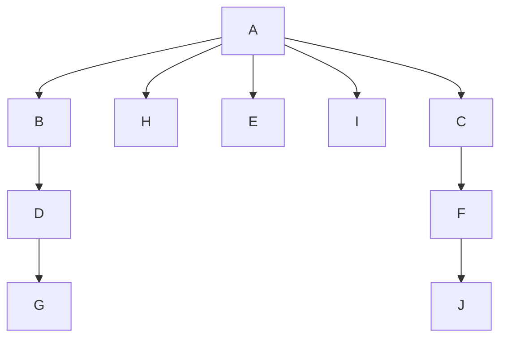
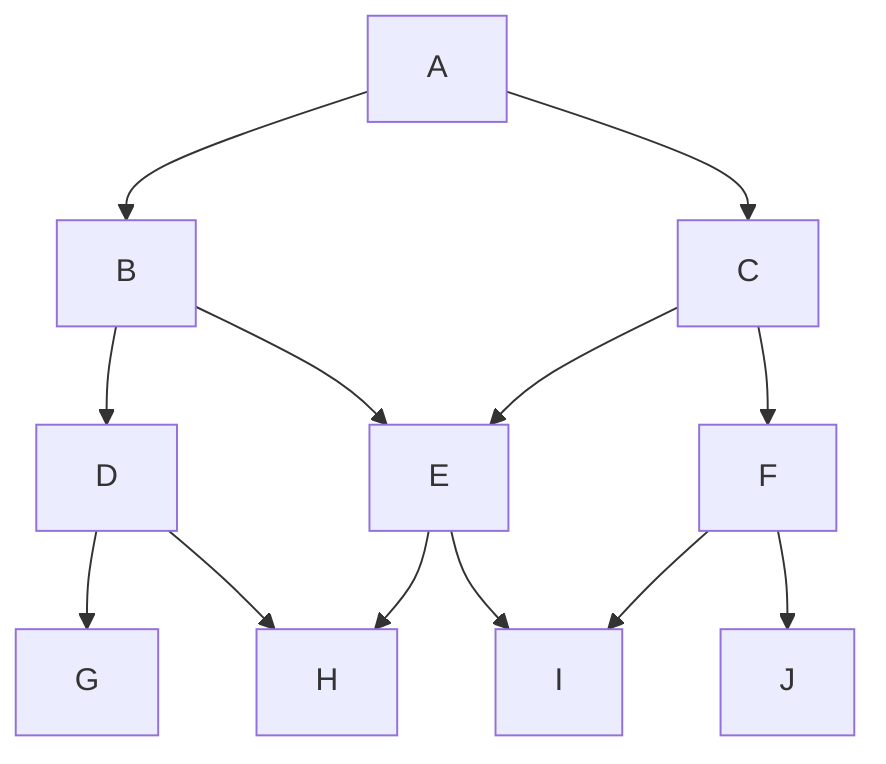

# Bowling-Game
My final project for Operating Systems I.

This console program consists on a Bowling Game made in C with system calls. It should be compiled as $ gcc -c bolos.c -o bolos (the executable must be called 'bolos'). The way it should be played is by executing ./bolos and then sending SIGTERM to the pin (process) called A (names can be displayed with $ ps -fu) and the signal will be propagated randomly simulating a pitch the way to send SIGTERM to A is executing ps -fu on your terminal, copy the PID of A and executing $ kill -SIGTERM <PID OF A>. After a few seconds (6) the result will be displayed in your terminal. 

The program creates a tree of processes with the following structure:

But in a logical way, we will propagate the SIGTERM signal making this structure, that is closer to the traditional bowling game pyramid:

Each pin can drop (propagate SIGTERM) to either one, none, or both of the pins it has below (insted of G,H,I,J that can't drop anyone). This means A can drop  B, C, both or none of them, E can drop H, I, both, or none of them and so on.

P.D.: The documentation is written in spanish.
